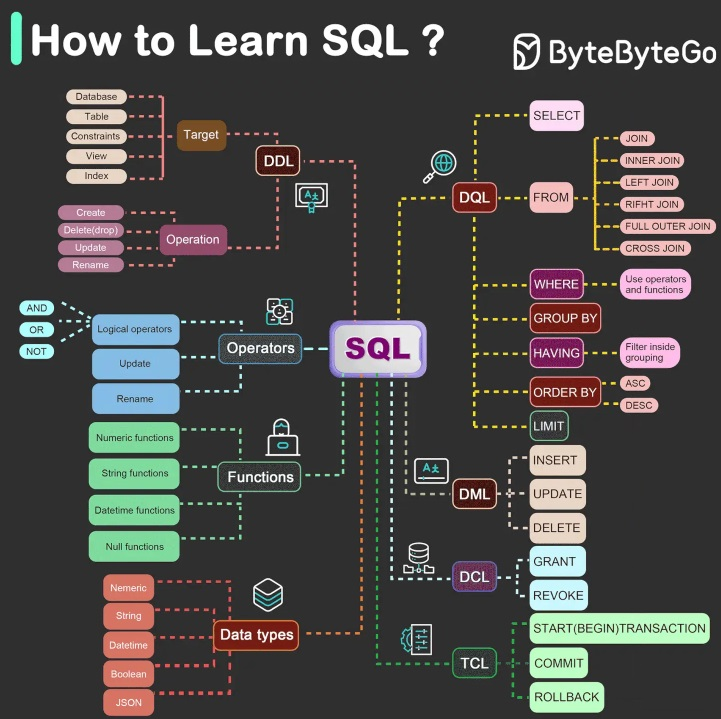

# Structure Query Language Notes

[SQL](https://en.wikipedia.org/wiki/SQL) is a standard declarative language for storing, manipulating and retrieving data in databases.

It's commands are mainly categorized into five categories, besides which there are operators, data types and functions which can be used to interact with the database.

**Mental Map Of SQL**



## Table of Content

1. [Data Definition Language (DDL)](#Data%20Definition%20Language%20(DDL))
	1. [CREATE](##Create)
	2. [ALTER](##Alter)
	3. [DROP](##Drop)
	4. [RENAME](##Rename)
3. [Data Query Language (DQL)](#Data%20Query%20Language%20(DQL))
4. [Data Manipulation Language (DML)](#Data%20Manipulation%20Language%20(DML))
	1. [INSERT](##INSERT)
	2. [UPDATE](##UPDATE)
	3. [DELETE](##DELETE)
	4. [TRUNCATE TABLE](#TRUNCATE-TABLE)
5. [Data Control Language (DCL)](#Data%20Control%20Language%20(DCL))
	1. [GRANT](##GRANT)
	2. [DENY](##DENY)
	3. [REVOKE](##REVOKE)
6. [Transaction Control Language (TCL)](#Transaction%20Control%20Language%20(TCL))
	1. [BEGIN TRANSACTION](#BEGIN-TRANSACTION)
	2. [COMMIT](#COMMIT)
	3. [ROLLBACK](#ROLLBACK)
7. [Querying & Order Of Execution](#Querying%20&%20Order%20Of%20Execution)
8. [Subqueries](##Subqueries)
9. [Joins & Correlation](#Joins%20&%20Correlation)
	1. [Set Operators](#Set-Operators)
		1. [Union](##Union)
		2. [Except](#Except)
		3. [Intersect](#Intersect)
	2. [Joins](##Joins)
		1. [Self Joins](#Self-Joins)
10. Common Table Expressions (CTEs or WITH Clauses) 
11. Data Types
12. Operators
13. Functions
14. [Window Functions](#Window-Functions)
	1. [Syntax](##Syntax)
	2. [Aggregate Window Functions](#Aggregate-Window-Functions)
	3. [Rank Window Functions](#Rank-Window-Functions)
	4. [Examples](##Examples)
15. Procedures
16. Triggers

## Data Definition Language (DDL)
SQL commands used to create data holding objects, such as tables, views, triggers or functions. They deal with defining the database schema, working with structure, not data.

These commands can target a database, table, constraint, index, function, view, trigger or a stored procedure.

### CREATE

| Description                                                                                   | Syntax                                                                 |
| --------------------------------------------------------------------------------------------- | ---------------------------------------------------------------------- |
| Create database or its objects (table, index, function, views, store procedure, and triggers) | `CREATE TABLE table_name (column1 data_type, column2 data_type, ...);` |

**Example**
```sql
-- T-SQL dialect
CREATE TABLE [dbo].[employees](
	[EmployeeNumber] [int] NOT NULL,
	[EmployeeFirstName] [varchar](50) NOT NULL,
	[EmployeeMiddleName] [varchar](50) NULL,
	[EmployeeLastName] [varchar](50) NOT NULL,
	[EmployeeGovernmentID] [char](10) NULL,
	[DateOfBirth] [date] NOT NULL,
	[Department] [varchar](50) NULL,
	[Manager] [int] NULL
);
```

### ALTER
| Description                                                         | Syntax                                                     |
| ------------------------------------------------------------------- | ---------------------------------------------------------- |
| Add, delete, or modify columns or constraints in an existing table. | `ALTER TABLE table_name ADD COLUMN column_name data_type;` |

**Example**
```sql
/* T-SQL dialect */
-- Change column data type
ALTER TABLE [dbo].[tblStampNames]
ALTER COLUMN Rarity varchar(30) NULL;

-- Drop column Rarity
ALTER TABLE [dbo].[tblStampNames]
DROP COLUMN;
```

### DROP

| Description                       | Syntax                   |
| --------------------------------- | ------------------------ |
| Delete objects from the database. | `DROP TABLE table_name;` |

**Example**
```sql
/* T-SQL dialect */
-- Delete table tblStampNames
DROP TABLE [dbo].[tblStampNames];

-- Delete column Rarity from table tblStampNames
ALTER TABLE [dbo].[tblStampNames]
DROP COLUMN;
```

### RENAME

| Description                               | Syntax                                           |
| ----------------------------------------- | ------------------------------------------------ |
| Rename an object existing in the database | `RENAME TABLE old_table_name TO new_table_name;` |


## Data Query Language (DQL)

SQL commands used to perform queries on the data within the database, mainly the `SELECT` statement. 

`SELECT` if often considered part of the Data Modification Language making the DQL category obsolete, but it's [argued](https://en.wikipedia.org/wiki/Data_query_language) that only when adding FROM or WHERE data manipulators to the SELECT statement the statement is then considered part of the DML.


## Data Manipulation Language (DML)

SQL commands _used_ to retrieve and manipulate data in a relational databases.

For `SELECT`, see [here][#Select] under DML.

### INSERT

Used to insert data into a table.
* Target can be table or a view.
* If columns are omitted, each value must be provided.
* If columns are included, they can be listed in any order.
* Columns with the IDENTITY property should not be explicitly listed.

| Description                                                                                                                                           | Syntax                                                                                           |
| ----------------------------------------------------------------------------------------------------------------------------------------------------- | ------------------------------------------------------------------------------------------------ |
| Inserts data into a table.                                                                                                                            | `INSERT INTO table_name (column1, column2, column3, ...)  VALUES (value1, value2, value3, ...);` |
| Column names can be omitted in case all row values are in the statement, ensure order of the values is in the same order as the columns it the table. | `INSERT INTO table_name VALUES (value1, value2, value3, ...);`                                   |
| Dynamic values (with `SELECT` statement to fetch data from another table directly).                                                                   | `INSERT INTO tableName SELECT * FROM aotherTableName WHERE someOptionalCondition`                |


```sql
/* PostgreSQL dialect*/
-- INSERT INTO one row example
INSERT INTO Customers (CustomerName, ContactName, Address, City, PostalCode, Country)  
VALUES ('Cardinal', 'Tom B. Erichsen', 'Skagen 21', 'Stavanger', '4006', 'Norway');

-- INSERT INTO multiple rows example
INSERT INTO Customers (CustomerName, ContactName, Address, City, PostalCode, Country)  
VALUES  
('Cardinal', 'Tom B. Erichsen', 'Skagen 21', 'Stavanger', '4006', 'Norway'),  
('Greasy Burger', 'Per Olsen', 'Gateveien 15', 'Sandnes', '4306', 'Norway'),  
('Tasty Tee', 'Finn Egan', 'Streetroad 19B', 'Liverpool', 'L1 0AA', 'UK');
```

### UPDATE

Changes data in existing rows either by adding new data or modifying existing data.
* If `WHERE` clause is omitted, all records in the table are updated.

| Description             | Syntax                                                                                |
| ----------------------- | ------------------------------------------------------------------------------------- |
| Update data in a table. | `UPDATE table_name SET column1 = value1, column2 = value2, ...  WHERE comeCondition;` |
**Example**

```sql
-- PostgreSQL dialect
-- Update multiple columns where condition is met example
UPDATE Customers  
SET ContactName = 'Alfred Schmidt', City= 'Frankfurt'  
WHERE CustomerID = 1;

-- Update column for all rows example
UPDATE Customers  
SET ContactName='Juan';
```

### DELETE

Deletes existing records in a table.
* Target can be table or a view.
* If `WHERE` clause is omitted, all records in the table are updated.
* It can affect only one base table at a time (cannot be used with a view that has a FROM clause naming more than one table).

| Description               | Syntax                                    |
| ------------------------- | ----------------------------------------- |
| Delete data from a table. | `DELETE FROM table_name WHERE condition;` |

**Example**

```sql
-- PostgreSQL dialect
-- Delete all rows in a table example
DELETE FROM table_name;

-- Delete row based on a condition example
DELETE FROM Customers 
WHERE CustomerName='Johnny Cage';
```

### TRUNCATE TABLE

* It's argued to be part of a Data Definition Language (DDL) rather than DML.
* `WHERE` clause cannot be used here.
* Performance is better in large data sets.

| Description                                        | Syntax                       |
| -------------------------------------------------- | ---------------------------- |
| Delete all data from a table (but keep the table). | `TRUNCATE TABLE table_name;` |

## Data Control Language (DCL)

SQL commands used to configure rights, permissions, and other controls of the database system.

### GRANT

| Description                                                                                                                 | Syntax                                                                                        |
| --------------------------------------------------------------------------------------------------------------------------- | --------------------------------------------------------------------------------------------- |
| Grants specific permissions (`SELECT`, `UPDATE`, `INSERT`, `DELETE`, etc.) on tables or views to a user.                    | `GRANT <some permission> ON <some object> TO <some user, login, or group>`;                   |
| `GRANT ... WITH GRANT OPTION` gives the user receiving the permission ability to grant the same permission to another user. | `GRANT <some permission> ON <some object> TO <some user, login, or group> WITH GRANT OPTION`; |


**Examples**
```sql
-- PostgreSQL dialect
-- Grant insert privilege to all users on table "films"
GRANT INSERT ON films TO PUBLIC;

-- Grant insert, update and delete priviledges to user joe on table "candidates" with option for joe to grant same priviledges to other users
GRANT INSERT, UPDATE, DELETE ON candidates TO joe WITH GRANT OPTION

-- Grant all privileges to user danilo on view "vw_products"
GRANT ALL PRIVILEGES ON vw_producs TO danilo;

-- Add user joe to admins role
GRANT admins TO joe;
```

### DENY

* **Not available in PostgreSQL**.
* Has the highest priority and will be considered first.
* It's explicit, meaning that it's different than user not having access configured.
* Can be removed with `REVOKE` command.

| Description                                                                                                                             | Syntax                                                                                        |
| --------------------------------------------------------------------------------------------------------------------------------------- | --------------------------------------------------------------------------------------------- |
| Denies specific permissions (`SELECT`, `UPDATE`, `INSERT`, `DELETE`, etc.) on tables or views to a user.                                | `DANY <some permission> ON <some object> TO <some user, login, or group>`;                    |

**Examples**
```sql
-- T-SQL dialect
-- Denies insert privilege to all users on table "films"
DENY INSERT ON [dbo].[films] TO PUBLIC;

-- Grant all privileges to user danilo on view "vw_products"
DENY ALL PRIVILEGES ON vw_producs TO danilo;
```

### REVOKE

* In PostgreSQL, it's used instead of `DENY` for explicit restrictions.
* In other databases, it's used to remove previously configured permissions with `GRANT` and `DENY` clauses.

| Description                                        | Syntax                                                                       |
| -------------------------------------------------- | ---------------------------------------------------------------------------- |
| Removes a previously granted or denied permission. | `REVOKE <some permission> ON <some object> TO <some user, login, or group>`; |

**Examples**
```sql
-- PostgreSQL dialect
-- Revoke (previously granted) insert privilege to all users on table "films"
REVOKE INSERT ON films TO PUBLIC;

-- Revoke (previously granted) insert, update and delete priviledges to user joe on table "candidates" 
REVOKE INSERT, UPDATE, DELETE ON candidates TO joe

-- Revoke (previously granted) all privileges to user danilo on view "vw_products"
REVOKE ALL PRIVILEGES ON vw_producs TO danilo;

-- Remove user joe to admins role
REVOKE admins TO joe;
```

## Transaction Control Language (TCL)

SQL commands used for for the management of transactions made by the DML commands.

A **Transaction** is a set of SQL statements that are executed on the data stored in DBMS. Commands in TCL mostly deal with committing and undoing those, ensuring database consistency and [ACID](https://en.wikipedia.org/wiki/ACID) compliance.

For each SQL statement we execute, it will by default be processed with `BEGIN TRANSACTION` in the beginning (marking the start of the transaction) and `COMMIT` TCL statement at the end, making the statement effect on the data permanent . This is called **implicit transaction**. 

In case something went wrong during execution where the transaction was not completed before complete execution (such as power loss), it would roll back complete transaction undoing everything, which is part of the ACID specification ensuring database consistency.

### BEGIN TRANSACTION

| Description                                                                                          | Syntax               |
| ---------------------------------------------------------------------------------------------------- | -------------------- |
| Marks the start of the transaction. End of transaction is specified either by `COMMIT` or `ROLLBACK` | `BEGIN TRANSACTION;` |

### COMMIT

| Description                                                    | Syntax    |
| -------------------------------------------------------------- | --------- |
| Saves the changes made in the current transaction permanently. | `COMMIT;` |
**Example**
```sql
-- PostgreSQL dialect
BEGIN TRANSACTION;  
UPDATE customers SET balance = balance + 100 WHERE customer_id = 1001;  
COMMIT;
```

### ROLLBACK

| Description                                                       | Syntax      |
| ----------------------------------------------------------------- | ----------- |
| Discards the changes made in the current transaction (like undo). | `ROLLBACK;` |
**Example**
```sql
-- PostgreSQL dialect
BEGIN TRANSACTION;  
UPDATE customers SET balance = balance + 100 WHERE customer_id = 1001;  
ROLLBACK;
```

## Querying & Order Of Execution

Order of execution will depend on which clauses are used in the SQL statement. In case all are used, here is the order.
### 1. FROM

* `FROM` will process the data from the single or multiple sources where the processed data set is stored in the temporary virtual table which is handed to the next logical step.
* `FROM` is evaluated even if the `SELECT` does not reference any of the columns from the data set. Even when `SELECT` without `FROM` is supported, dummy table is created and order of execution goes straight from `SELECT`.
* These requirements are evaluated when `FROM` processes the source data:
	* Each set and column is uniquely aliased.
	* Sets are unordered.
* Source can be a table, view, function or a subquery derived table.
* When `JOIN` is used, additional logical steps happen before forming the final data set:
	*  Each join goes through [cartesian product](https://en.wikipedia.org/wiki/Cartesian_product) forming first. If `CROSS JOIN` was used, the procedure stops here.
	*  Inner and outer joins are going through a **qualification** procedure based on the `ON` keyword where the condition is evaluated for every row and only rows where condition is met are found in the final data set. For inner joins, the procedure stops here.
	*  For outer joins, qualified rows move to the **reservation** procedure where, depending on the outer join type, required rows removed during qualification are put back with NULLs assigned.

### 2. WHERE

* Get's the processed data from the `FROM` clause and applies configured filtering.
* Where filter condition was not met, row is removed from the result set.
* When outer joins are used, `WHERE` can remove non-qualified data (those with null values where there was no match on the `ON` condition) so filtering might be better achieved in the `ON` condition.
* Filters around `NULL` cannot be written with usual operators `>`,`=`, etc. since the `NULL` is not a value but rather an indicator of the absence of one.
	* `ISNULL()`, `IS NULL` and `IS NOT NULL` are used.
	* `IS DISTINCT FROM` and  `(comparison) IS NOT TRUE` can be used for better results in PostgreSQL only.

### 3. GROUP BY

* Unlike with just `WHERE` which process individual rows and returns them as detailed results, `GROUP BY` will treat groups of rows as a single unit, returning aggregated results where single row data is lost in the result set.
* When `GROUP BY` get's the processed data from the `FROM` clause, it will check rows and mark them for grouping based on the criteria from the `GROUP BY` clause.
* Then it transforms the data set to a grouped structure similar to pivot table in Excel.
* When `GROUP BY` is used, `SELECT` can only have columns which are not of the grouping expression or columns enclosed in an aggregate function, since only those are guaranteed to have the same value for all the rows within a group (point of grouping).
* Aggregate functions ignore `NULL` values,

### 4. HAVING

* Similar to `WHERE` clause, it will apply configured filtering but to the processed data passed to it by the `GROUP BY` clause.
* Since it filters grouped data, it can use aggregate functions in the filter.

### 5. SELECT

* Takes result set processed by previous steps ready for presentation and will be final step before outputting results in case `ORDER BY` or paging clauses are used.

### 6. ORDER BY

* Before the result set the `SELECT` is now holding is outputted, it's passed by to the `ORDER BY` clause (in case it's used) to be sorted as configured in the clause.
* At this point, data set becomes a [cursor](https://en.wikipedia.org/wiki/Cursor_(databases)).
* It can use column names or ordinal numbers starting with 1.
* It can sort columns even if they are not in the `SELECT` statement unless `DISTINCT` is used (DISTINCT groups row which is why they need to be part of the SELECT statement).
* NULLs are also sorted but depending on the database system:
	* MySQL and MS SQL server gives them lowest sorting value (goes first in ASC order).
	* PostgreSQL and Oracle gives them highest sorting value by default but support changing it with `NULLS FIRST` or `NULLS LAST` keywords.
	
### 7. PAGING
* Process of separating large row sets into smaller chunks (pages, process of pagination) by using `TOP()` in MS SQL or `LIMIT n` in other with `OFFSET`.


## Subqueries

Subquery is a query (inner query) which returns data looked by another query written before it (outer query).

* It can return a table, a row or a single value (scalar).
* Can be **correlated** (references a value from an outer query thus depending on it and cannot be executed as a standalone query) or **non-corelated** (can stand alone, no other query dependencies).


## Joins & Correlation

### Set Operators

They are used between two separate `SELECT` statements combining the result sets vertically.
* `NULL` is treated same as other values.
* Column names in combined `SELECT` statements are not important.
* Distinct variant of all set operators performs grouping operation on the result set by removing the duplicates.

#### UNION

Returns combined result sets of two or more `SELECT` statements.
- Every `SELECT` statement within `UNION` must have the same number of columns
- The columns must also have similar data types
- The columns in every `SELECT` statement must also be in the same order

| Operator             | Description                                                                                                                                                                                                                                                                    |
| -------------------- | ------------------------------------------------------------------------------------------------------------------------------------------------------------------------------------------------------------------------------------------------------------------------------ |
| `UNION DISTINCT`     | Default, returns all unique elements from both data sets (removes duplicates).                                                                                                                                                                                                 |
| `UNION ALL`          | Returns all elements from both data sets.                                                                                                                                                                                                                                      |

**Example**s

```sql
/* T-SQL dialect*/
-- UNION DISTICNT example
SELECT * FROM [dbo].[tblStampNames]
UNION
SELECT * FROM [dbo].[tblStampNamesArchive]

-- UNION ALL example
SELECT * FROM [dbo].[tblStampNames]
UNION ALL
SELECT * FROM [dbo].[tblStampNamesArchive]
```

#### EXCEPT

Returns result set containing only values from the first table which are not present in second table.
* Called `MINUS` in other SQL variants.
- Every `SELECT` statement within `EXCEPT` must have the same number of columns
- The columns must also have similar data types.

| Operator          | Description                                                                                                                                                                                                                                                                    |
| ----------------- | ------------------------------------------------------------------------------------------------------------------------------------------------------------------------------------------------------------------------------------------------------------------------------ |
| `EXCEPT DISTINCT` | Default, returns elements present in first data set, but not in the second                                                                                                                                                                                                     |
| `EXCEPT ALL`      | Returns elements present in first data set, but not in the second. <br>When there is presence of elements in both sets, it will return *MAX(num_of_elements_in_first_set - num_of_elements_in_second_set, 0).*  **Note: this one is only available in PostgreSQL and MariaDB** |

```sql
/* PosgreSQL dialect*/
-- EXCEPT DISTICNT example
SELECT Name, Hobby, Age FROM students
EXCEPT 	
SELECT Name, Hobby, Age FROM students_hobby;

-- EXCEPT ALL example (only in PostgreSQL, MariaDB)
SELECT Name, Hobby, Age FROM students
EXCEPT ALL
SELECT Name, Hobby, Age FROM students_hobby;
```

#### INTERSECT

Returns result set containing only values which are present in both tables (duplicates).
- Every `SELECT` statement within `INTERSECT` must have the same number of columns
- The columns must also have similar data types.

| Operator             | Description                                                                                                                                                                                     |
| -------------------- | ----------------------------------------------------------------------------------------------------------------------------------------------------------------------------------------------- |
| `INTERSECT DISTINCT` | Default, returns an element present in both data sets.                                                                                                                                          |
| `INTERSECT ALL`      | Returns elements present in both data sets. When calculating what to return, it returns minimum value present in both data sets. **Note: this one is only available in PostgreSQL and MariaDB** |

```sql
/* PosgreSQL dialect*/
-- INTERSECT DISTICNT example
SELECT Name, Hobby, Age FROM students
INTERSECT 	
SELECT Name, Hobby, Age FROM students_hobby;

-- INTERSECT ALL example (only in PostgreSQL, MariaDB)
SELECT Name, Hobby, Age FROM students
INTERSECT ALL
SELECT Name, Hobby, Age FROM students_hobby;
```


### Joins

A `JOIN` clause is used to combine rows from two or more tables, based on a related column between them.

Most joins use equality condition on which the tables are joined, but can also use non-equality conditions.

Processing logic of joins inside `WHERE` clause goes in  these steps:
1. **Cartesian product** - every join starts with [cartesian product](https://en.wikipedia.org/wiki/Cartesian_product). If `CROSS JOIN` was used, the procedure stops here.
2. **Qualification phase** - inner and outer joins are evaluated row by row based on the condition defined via `ON` keyword and only rows where condition is met are found in the final data set. For inner joins, the procedure stops here.
3. **Reservation phase** - for outer joins, qualified rows move to the **reservation** procedure where, depending on the outer join type, required rows removed during qualification phase are added back with NULLs assigned.
#### Self Joins

These are when same table is used multiple times in the `FROM` clause, joining each to itself.
*  Same table can be used multiple times in same statement as long each instance is uniquely aliased.
* Each instance of table expression is independent of each other.


## Window Functions

These are functions which can look up values from other rows and apply them to current row, allowing access to neighboring rows without using subqueries.

- They perform operations on a subset of the result set defined by a window or frame. 
	- Frame is a defined part of the result set on which the Window function is applied. 
	- Window is a part of the frame on which the function is applied at the moment of execution. It can span the whole frame or just a part of it, in case the frame is partitioned into groups. 
- Window functions can be used only in SELECT and ORDER BY clauses.
- They are used to solve problems like most recent or older value, rolling averages etc.
- Three types of Window functions: aggregate, ranking and value functions.
- `NULL` is handled differently between different types of window functions:
	- Aggregate functions ignore NULLs.
	- Rank and distribution functions respect NULLs.
	- Framing respect NULLs.


### Syntax

```sql
Function (expressions)
FILTER (WHERE conditions)
OVER (
	[PARTITION BY expressions]
	[ORDER BY Expressions [NULLS FIRST|LAST]]
	[Frame type BETWEEN Frame start AND Frame end]
	[Exclude Frame exclusion]
)
```

* Function (expressions) - function name and expressions
* **`FILTER (WHERE conditions)` **
	* Limits the scope of the window\frame with logical conditions
	* Affects only what is shown in the window, not data from the query
* **`OVER ()`**
	* Set of definitions for the window/frame
	* If blank `OVER` is used, window will span over whole data set
	* **`PARTITION BY`**
		* Known as a aggreaggate, similar to `GROUP BY`, it groups rows based on the common value creating groups on which the windows function will be applied to
		* Instead of row by row, it applies to group by group.
	* **`ORDER BY`**
		* Defines sorting criteria.
	* **Framing includes these options:**
		* `ROWS`
			* To define frame by counting rows in relation to the current row.
			* Values are not looked, only number of current row.
		* `RANGES`
			* To define frame by specifying value range in relation to the current row value.
			*  They depend on the row's value as the range definitions is specified as value (interval value for the date ranges for example).
		* `GROUPS`
			* To define frame by specifying number of groups.
		* These are defined as beginning and end of a frame in a `[Frame type BETWEEN Frame start AND Frame end]` expression.
		* In case framing is not explicitly stated and `ORDER BY` is used, default is assumed as `RANGE BETWEEN UNBOUNDED PRECEDING AND CURRENT ROW`.
	* **Exclusions**
		* Optional feature to define exclusions.
		* `EXCLUDE NO OTHERS`, `EXCLUDE GROUP`, `EXCLUDE TIES` and `EXCLUDE CURREN ROW`-

### Aggregate Window Functions
Aggregate functions are functions which take a group of elements, apply some operation and return one element.

Window aggregate function are similar.
* They are applied to groups of rows with common value, targeting groups, not inside rows.
* Unlike Group Aggregate Functions: 
	* They do not "see" individual rows inside of a group.
	* They do see other groups inside of a window.

**Examples**
```sql
-- PostgreSQL dialect
-- Shows average heart rate for each animal species in a table
SELECT species, name, checkup_time, heart_rate,
	CAST (
		AVG(heart_rate)
		OVER (PARTITION BY species)
		AS DEMIMAL (5, 2)
	) AS species_average_heart_rate
FROM
	routine_chgeckups
ORDER BY species ASC, checkup_time ASC;
```

### Rank Window Functions
Rank is a position in an hierarchy, a relationship in which between two elements it is possible to say which one ranks higher or lower.

Ranking window functions are used to rank results.
* Partitioning is optional for rank functions.
* `ORDER BY` is mandatory as it defines the rank criteria.

Two window functions in Rank category:
1. `RANK()`
	*   Assigns each row a rank number starting from 1, ranking items based on the `ORDER BY` criteria.
	* All ties are assigned the same rank number, and the next ranked item will skip all possible rank values if those were not ties (if three items were ranked 2, next rank will not be 3 but  6).
2. `DENSE_RANK()`
	*   Assigns each row a rank number starting from 1, ranking items based on the `ORDER BY` criteria.
	* All ties are assigned the same rank number, but the next ranked item will not skip possible rank values if those were not ties (if three items were ranked 2, next ranked item will be 3).

These two are also sometimes considered as ranking functions:
1. `ROW_NUMNBER()`
	* Shows a row number of an item.
2. `NTILE()`
	* Segments a partition in an "equal as much as possible" segments called tile.
	*  It assigns numbers to tiles starting from 1.


#### Examples

**ROW_NUMBER()**
```sql
-- T-SQL dialect
-- Example with ROW_NUMBER function to return customer's most recent order
WITH cte_rowNumbers AS (
	SELECT [OrderNum],[OrderDate],[ProdName],[Quantity],
	ROW_NUMBER() OVER(
		PARTITION BY [CustName] 
		ORDER BY [OrderDate] DESC) AS ROW_NUM 
	FROM [dbo].[OnlineRetailSales$]
	)

SELECT * FROM cte_rowNumbers
WHERE ROW_NUM = 1;

/*
RESULT:

OrderNum   OrderDate                 ProdName                  Quantity   ROW_NUM
1101870    2018-01-14 00:00:00.000   Delta Robots              1          1      
1101685    2017-12-18 00:00:00.000   BYOD-400                  1          1      
1101370    2017-11-03 00:00:00.000   Panda Robot Blueprint     1          1      
1102807    2018-06-05 00:00:00.000   DTI-84 Drone              2          1      
1104858    2019-03-26 00:00:00.000   Cat Robot Blueprint       5          1      
1103813    2018-10-21 00:00:00.000   Delta Robots              1          1      
1105515    2019-06-30 00:00:00.000   AI for Educators          1          1      
1105786    2019-08-12 00:00:00.000   BYOR-1500                 2          1      
1103148    2018-07-17 00:00:00.000   Building Your Own Drone   1          1      
1105792    2019-08-12 00:00:00.000   Photograph Drones         12         1      
*/

/*
NOTES
- First we put our data set in the common table expression for easier reading.
- ROW_NUM() is used in a window partitioned by CustName
- Ordered by OrderDate DESC to put newest dates on top
- Where counting of rows with ROW_NUM() starting with 1 will show newers order
- ROW_NUM column is added just to see it's value (1)
*/
```

**RANK() & DENSE_RANK()**
```sql
-- T-SQL dialect
-- Example to rank employees in alphabetical order by their last name
-- See side-by-side differences between Rank_ and Rank_Dense
SELECT [First Name],[Last Name],
RANK() OVER (ORDER BY [Last Name]) AS Rank_, -- Standard RANK()
DENSE_RANK() OVER (ORDER BY [Last Name]) AS Rank_Dense -- DENSE_RANK()
FROM [dbo].[EmployeeDirectory$]
WHERE [Last Name] LIKE 'D%'

/*
RESULT:

First Name   Last Name   Rank_   Rank_Dense
Julie        Davenport   1       1         
Logan        Davenport   1       1         
Devin        David       3       2         
Yvette       Diaz        4       3         
Hector       Dillon      5       4         
*/
```


## References

1. Good advanced courses with deep dives in SQL internals by Ami Levin on [LinkedIn](https://www.linkedin.com/learning/instructors/ami-levin). See Advanced SQL series about query processing and Window functions.


