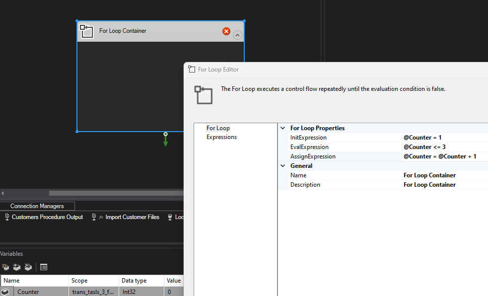

#sql #ssis
# Microsoft SQL Server Integration Services
Enterprise level data integration and transformation platform able to perform [ETL](https://en.wikipedia.org/wiki/Extract,_transform,_load) tasks. It automates extracting and transforming the data from one place to another.

## ETL (Extract, Transform, Load)
Three-phase process where data is [_extracted_](https://en.wikipedia.org/wiki/Data_extraction "Data extraction") from an input source, [_transformed_](https://en.wikipedia.org/wiki/Data_transformation "Data transformation") (including [cleaning](https://en.wikipedia.org/wiki/Data_cleaning "Data cleaning")), and [_loaded_](https://en.wikipedia.org/wiki/Data_loading "Data loading") into an output data container.

**Extract**
* Pull data from one or many sources.
* SQL Server, DB2, Oracle, Flat files, Excel spreadsheets and cloud apps are all valid sources.

**Transform**
* Apply business rules to the data.
* Clean up data, do aggregation, merge, math functions etc.

**Load**
* Send transformed data to a destination.

## Installation

1. Install Visual Studio
	1. [Download](https://learn.microsoft.com/en-us/visualstudio/install/install-visual-studio?preserve-view=true&view=vs-2022) Visual Studio installer and make sure to select "Data storage and processing" workload during installation.
	2. If you already have Visual Studio, re-launch the installer and just add "Data storage and processing".
2. Install SQL Server Integration Services Projects 2022 (at the moment of writing)
	1. Once in the Visual Studio, Click "Extensions", find "SQL Server Integration Services Projects" and install it.

Visit [SQL Server Data Tools](https://learn.microsoft.com/en-us/sql/ssdt/download-sql-server-data-tools-ssdt?view=sql-server-ver16) for updated links and more details.

## Components & Terminology

SSIS project, when edited in VS, is structured as:
* Solution, which contains the project
	* Project, which contains the packages
		* Package, which holds the processing logic.

| Item       | Description                                                                                                                                                                                                                           |
|------------|---------------------------------------------------------------------------------------------------------------------------------------------------------------------------------------------------------------------------------------|
| Solution   | Logical grouping of related projects.                                                                                                                                                                                                 |
| Project    | Collection of defined packages holding logic of the ETL task which was being handled. Project is deployable unit - once you are done defining tasks in packages, project gets deployed on the SQL server for execution or scheduling. |
| Package    | Collection of operations or tasks in a project, central unit of the SSIS.                                                                                                                                                             |
| Task       | Single operation of the SSIS package.                                                                                                                                                                                                 |
| Component  | Part of the data pipe line - can be a source, destination or transformation in the data pipe line.                                                                                                                                    |
| Execution  | Act of running the logic defined in the SSIS package.                                                                                                                                                                                 |
| Deployment | Act of deploying completed SSIS project on an instance of the SQL server where it can be executed or sheduled.                                                                                                                        |
## Package Design Structure

Consists of Control Flow, Data Flow, Parameters and Event Handlers.

### Control Flow
* Controls the flow of execution, like a main window where you chain different tasks.
* Contains different tasks, show them graphically as chained blocks of logical units describing the procedure.
* It can stack multiple data flow tasks along side tasks such as actions in the databases, executing SQL commands, file system actions etc.
* In case blocks of Control Flow tasks are **not connected sequentially, they will execute in parallel.** Meaning, you can have multiple procedures in one Control Flow running asynchronously.

#### Precedence Constraint
Between blocks of Control Flow tasks arrows are drawn to create order of execution or define parallel execution.  Such arrows defining order of operation is called precedence constraints and those can be expressed as:
* Success
* Failure
* Completion

This kind of expression of constraint type provide means of defining flow logic such as:
* If this task is successful, do this (Green arrow).
* If it failed, then do this (Red arrow).

**Steps to configure**
1. Once you draw flow from one task to another, double click the arrow.
2. This will open an editor window where you choose the "Value" of the "Constraint" to be "Success", "Failure" or "Completion". Default is "Success".

#### Expressions
You can also define custom conditions for the flow using expressions. Instead of having "success", "failure" or "completion", custom expressions can be defined to control the flow more precisely.

**Steps to configure**
1. Once you draw flow from one task to another, double click the arrow.
2. This will open an editor window, choose the "Evaluation operations" as "Expression"
3. In "Expression", click the three horizontal dots to open an expression builder where you'll have access to built in functions and variables.
	1. Here the aim is to construct an expression which returns boolean.
	2. There will be an useful option for evaluating conditions.
4. In case you define multiple constraints, there will be an option to choose whether logical "AND" or logical "OR" is applied.

**Examples of expressions**
* `DATEPART( "DD", getdate()) > 15` 
	* Checks if current day of the month is greater than 15th
	* Means that if it is, next task (and other chained to it) will execute, otherwise will not.
* `DATEPART( "DD", getdate()) > @[User::day_of_month]` 
	* Same example as above which is using a variable called "day_of_month".

#### Variables
* Same as in other languages, it's a temporary storage which can be called upon.

**Steps to configure**
1. In the main Control Flow window, right click, then do  "Variables".
2. "Variables" windows will appear. Here you can click "New".
3. Under "Name" give it a name.
4. Under "Data type", select appropriate data type.
5. Under "Value", put the value you want to store or use "Expression" to dynamically create values.

 
 
### Data Flow
* One of the tasks in Control Flow - defines source, transformation and destination tasks as a single "container" of data flow tasks.
* Inside one data flow task, many ETL steps can be configured to fetch data, transform it and store it elsewhere.
* Basically heart of the SSIS platform.

#### Types Of Transformation
* Can be classified as synchronous and asynchronous.
* Can also be classified as blocking, non-blocking and semi-blocking.

### Event Handlers
* At run time, packages and containers raise events (such as OnError event).
* Custom events can be defined to extend the functionality.

**Steps to configure**
1. In the main package design window, click on the "Event Handlers" tab.
2. You'll be able to select there:
	1. Executable: To which package, task or container this event applies.
	2. Event handler: which type of event will trigger the handler.
3. Now put other tasks here, such as "Execute SQL Task" or "Data Flow" tasks depending on actions you wish to take if the event is triggered.

Example would be writing an log to a file or a database or sending an email notification.

## Defining Connections

To be able to import source data or export processed data, connections have to be defined.
### Flat File Connection
If creating for source:
* Browse to a flat file (text, csv, Excel).
* Once loaded, check if encoding and delimiter is fine. "Columns" should show correct tabular representation of your data.

If creating for destination:
* Write absolute path to where your csv or txt file should be saved.
* Review delimiter, row and column configuration.
* Once you connect your data to it, make sure to configure mappings.

### Local Microsoft SQL Server
Few thing to note: 
* For these connections one connection targets one specific database (not a table).
* Tables can be created by the SSIS package task, but databases cannot.
	* Once destination connection is configured in the package, table will be created (but not with data). Data will be transferred on the execution of the task.
* If need to work with different databases on the same server, each will need a separate connection.

**Steps to configure connection:**
1. Choose "ADO.NET" from the connection options in the Connection Manager.
	* [ADO.NET](https://en.wikipedia.org/wiki/ADO.NET) is a data access technology to establish communication between relational and non-relational systems .
2. For server name, type `.` (this means localhost)
3. Configure authentication (mine was "Windows Authentication").
4. Select database to work with.

## Data Transformation Tasks

### Data Conversion
* Takes input columns, performs data conversion and stores values into new columns.

**Steps to configure**
1. Once inside the data conversion block, select input columns you want to convert.
2. Rename "Output Alias" (new columns where the data will be stored) to something meaningful.
3. Chose new Data type (the one matching destination).
4. Optionally, length, precision, scale and code page can be configured.

Once in the destination mapping, make sure to select newly created columns (ones from "Output Alias").

### Derived Column
* Creates new column and allows expressions to be used where other columns can be used to produce new values.
* Example is concatenating first letters of first name and last name columns to create initials.

**Steps to configure**
1. Once inside the derived column block, there will be a section with variables and columns on the left and functions on the right. Those are all building blocks which can be used to create derived column.
2. Write "Derived Column Name", best to match column in the destination.
3. Under "Derived Column" chose either to create new column, or replace existing one on the fly.
4. Under expression, write an SQL like expression to create your new column. Functions, variables and columns from the upper sections can be used here.
5. Data type, length, precision, scale and code page can also be configured here.

### Character Map
* Provides means of changing characters by applying string function to them, such as making upper or lower case.

**Steps to configure**
1. Once inside the Character Map block, select input columns you want to work with.
2. In the column list, set "Destination" as an in-place change or a new column.
3. In the column list, set "Operation" to perform a certain string function.
	1. Useful ones will be Uppercase and Lowercase.

More details in the official docs [here](https://learn.microsoft.com/en-us/sql/integration-services/data-flow/transformations/character-map-transformation?view=sql-server-ver16).

### Sort
* Provides means of sorting the data based on a column.

**Steps to configure**
1. Once inside the Sort block, select input columns you want to work with.
2. Choose "Sort Type" as ascending or descending.

### Multicast
* Provides means of creating multiple output streams of single input making saving transformed data at multiple places at once possible.

**Steps to configure**
1. Add Multicast block and point connections to multiple destinations.

### Conditional Split
* Provides means of defining filters to further process the dataset (same as with `WHERE` statement in SQL)
* Goal is to filter data on some criteria and passing the filtered result down the pipeline.

**Steps to configure**
1. Once inside the Conditional Split block, Similar to "Derived Column", there will be a section with variables and columns on the left and functions on the right. Those are all building blocks which can be used to create filter.
2. Choose a column from "Columns" which you'll be using for the filtering
3.  In the "Condition", write your statement or choose one of the functions from the selection above.
4. If you want to give this filter a custom name, under "Output Name" rename "Case 1" to something else.
5. Once you connect this to a next step in the pipeline, it will as which filter to use, select your filter or "Case 1" if you did not rename it.

### Merge
* Combines rows from 2 sources of sorted data.
* It requires data to be sorted (so use Sort transformation task).
* Similar to SQL `UNION` but it does not remove duplicates.
* If sorting is not important, use "Union All" task.
* If you have more than two sources, use another Merge block and connect previously merged data and the third source.

**Steps to configure**
1. Prior to connecting data pipe to the Merge block, have one Sort block to sort the data.
2. Merge can take 2 sources - once first sorted source is connected to the Merge, it will ask which slot to use.
3. Connect the other source.

### Union All
* Combines rows from multiple sources of data.
* Similar to SQL `UNION ALL` .
* If sorting is important, use Merge.

**Steps to configure**
1. Connect data pipes to the Union All block to merge the data.

### Merge Join
* Combines two sorted data flows using FULL, LEFT or INNER JOIN.
* It requires data to be sorted (so use Sort transformation task).

**Steps to configure**
1. Prior to connecting data pipe to the Merge Join block, have one Sort block to sort the data.
2. Merge Join can take 2 sources - once first sorted source is connected to the Merge Join, it will ask which slot to use.
3. Once both sources are connected, open the Merge Join block and configure:
	1. Join type (Inner, Left outer, Full outer).
	2. Select columns to be included from both data sets.
	3. Select "Join Key" in both sources so the join action can be performed.
	4. Optionally, rename output aliases if needed.

## Control Flow Tasks
* Tasks not necessarily related to data flow and ETL but different support or batch tasks outside of data flow, such as: 
	* Execute SQL tasks in the database, copying files, reorganizing database indexes or compressing databases, etc.
	* Bulk inserts, executing processes, executing other packages, file system tasks etc.

### Execute SQL Task
* Executes an SQL statement or stored procedure in an relational database for which there is defined connection.
* Most usefully for cleaning existing data in a table before executing Data Flow task which will upload new data.

**Steps to configure**
1. Make sure you have a connection to the relational database configured.
2. Once in the "Execute SQL Task" block, under "General", configure:
	1. Connection type: OLE DB or ADO.NET, depending on what you configured in the connection.
	2. Connection: Choose existing connection.
	3. SQL Statement: write your SQL statement, example: `TRUNCATE TABLE [dbo].[Customers]`.

### File System Task
* Performs operations on files and folders in the file system.
* You can delete, create or copy files and folders.

**Steps to configure**
1. One in the "File System" block, chose the "Operation" you want to perform.
2. Configure parameters and connection variables under "Destination Connection" and "Source Connection"
	1. Pay attention to things such as "Overwrite existing file" or "Check if folder exists" which might be essential.
3. Make sure to configure connections to files or file system places where you want to perform operations.
	1. Once in the connection manager editor, it will ask you for the usage type (create new, select existing, etc.).

### Execute Process Task
* Provides means of running batch files or applications present in the file system.
* Useful to execute external batch scripts or do tasks with cli tools.

**Steps to configure**
1. Once inside the "Execute Process" block, click "Process" in the left menu.
2. Under "Executable" you can put name of the executable if it's part of the Windows "PATH" or absolute path to your script\application
	1. Example: `%windir%\system32\msinfo32.exe` will execute System Information panel.
3. Optionally and depending on you case, you can use other self-explanatory fields to define cli arguments for your app, variables for input and output, timeouts and window styles.

### Execute Package Task

* Used to execute another package as part of the control flow of the current package.
* Useful in complex procedures where you might have a "master package" containing order of execution of other packages.

**Steps to configure**
1. Once in the "Execute Package" container, give it a meaningful name.
2. Click "Package", then configure:
	1. ReferenceType - whether the package will come from within the project or will be an external package.
	2. Depending on the selection; "External Reference" will have additional fields. For the "Project Reference", select from "PackageNameFromProjectReference" which package you want to execute.
3. Optionally, parameter bindings and expressions can be configured,

### Containers
#### Sequence Containers
* Used to group multiple control flow tasks for easier management.
* Grouped items will have the execution order between them inside of the container regardless of the grouping.
* Option to "Execute container" will appear.
* Can be used as a scope for variables.

**Steps to configure**
1. From "Containers", add "Sequence Container" block to the Control Flow window.
2. Give it a meaningful name.
3. Drag and drop to it Control Flow tasks you want to group.
4. Review and configure the execution order by drawing out the execution lines both for the grouped items inside the container, and the items outside of it.

#### Foreach Loop Container
* Similar to foreach loop in programming languages, it will iterate over a collection of items, such as files in a directory or emails in an recordset.

**Steps to configure**
1. Once inside the Foreach Loop container block, give it a name and description if needed.
2. Click on the "Collection", then configure "Enumerator" which means what you will be iterating over (files, variables, rowsets from databases).
3. Depending on your selection, you'll need to configure additional parameters, such as folder and file names in case the enumerator is set to be a file.
4. Click on the "Variable Mappings" in case you need to store result of enumerator to a variable.
5. Once you configured looping logic, you can add any data flow blocks to the Foreach container to loop over.
	1. Example, if you looped over each file in a folder and stored the absolute path of each file to a variable, you could add a data flow task to read each file and store it to the database. That way, one one connection was needed for as many files in the folder.

#### For Loop Container
* Similar to for loop in programming languages, classic iteration mechanism where you need to define starting value, increment logic for it and the completion condition so the loop has an exit strategy. 
* Useful when you need the increment value on each iteration (days between the two dates, sequence of numbers in a rage, etc.).

**Steps to configure**

In this example, we are configuring a for loop which will use `counter` variable to store the current iteration, start at number 1 and end at number 3.

1. Create a new variable called "Counter", type: Int32, Value: 0.
2. Once inside the For Loop container block, there will be three For Loop Properties to configure:
	1. InitExpression: `@Counter = 1`
		1. This one is the initial value from which the loop starts from.
		2. It can be just a value, but it's more usefull to map it to a variable we previously created.
		3. We are saying here that the starting point is variable "Counter" with a value of 1.
	2. EvalExpression: `@Counter <= 3`
		1. This one will stop the looping once the expression written here evaluates to False.
		2. Can be just a value but we are using our variable here.
		3. We are saying here: when the counter is less than or equal to 3, stop the loop.
	3. AssignExpression: `@Counter = @Counter + 1`
		1. This is the increment logic which will change the counter on each iteration so we can actually reach the exit expression.
		2. Can be decremental, same as elsewhere with for loops.

